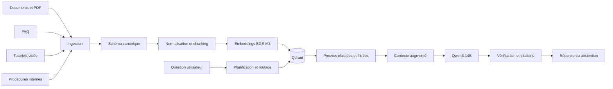

# Reception Assistant — RAG multimodal pour les équipes hôtelières

Assistant documentaire capable de rechercher dans des procédures, FAQ, documents et tutoriels vidéo afin de produire une réponse opérationnelle, vérifiable et accompagnée de ses sources.

Le projet illustre un pipeline RAG complet : ingestion multimodale, normalisation, chunking spécialisé, embeddings multilingues, recherche vectorielle, routage, génération contrainte, citations, abstention et évaluation de bout en bout.

## Le problème traité

Les connaissances nécessaires à une équipe de réception sont généralement dispersées entre :

- la documentation d’un logiciel de gestion hôtelière ;
- des FAQ ;
- des tutoriels vidéo ;
- des procédures internes propres à l’établissement.

Retrouver une information précise peut demander plusieurs recherches, et une réponse métier peut nécessiter à la fois une procédure logicielle et une règle interne.

Reception Assistant transforme ces sources hétérogènes en une base de connaissances unifiée, puis répond uniquement à partir des preuves retrouvées.

## Ce que le système apporte

- Recherche sémantique en français et en anglais.
- Réponses fondées sur des sources vérifiées.
- Citations de documents, pages PDF et passages vidéo horodatés.
- Distinction entre utilisation du logiciel et politique de l’établissement.
- Questions conversationnelles et reformulation des demandes de suivi.
- Abstention explicite lorsque les preuves sont insuffisantes.
- Exécution locale sur GPU ou utilisation d’API compatibles OpenAI.
- Architecture indépendante de la plateforme de gestion hôtelière.

Le système est volontairement en lecture seule : il explique et documente une procédure, sans exécuter d’action dans un outil métier.

## Architecture



### Pipeline d’indexation

1. Les sources sont lues avec un parseur adapté à leur format.
2. Elles sont converties en documents canoniques partageant le même schéma.
3. Le texte est nettoyé, dédupliqué et enrichi de métadonnées de provenance.
4. Le chunking respecte la structure de chaque source : section, paire question-réponse, procédure ou action vidéo.
5. BGE-M3 produit les représentations vectorielles multilingues.
6. Qdrant stocke les vecteurs, le texte et les métadonnées filtrables.

### Pipeline de réponse

1. Un planificateur transforme la demande en question autonome.
2. Un routeur choisit les connaissances logicielles, les règles de l’établissement ou les deux.
3. Qdrant retourne les passages les plus pertinents avec un seuil de confiance et une diversification des sources.
4. Les preuves sont organisées dans un contexte numéroté.
5. Qwen3-14B génère une réponse courte et sourcée.
6. Une seconde passe vérifie les affirmations, montants, autorisations et citations.
7. En l’absence de preuve suffisante, le système s’abstient.

## Compréhension des tutoriels vidéo

Les vidéos ne sont pas réduites à une simple transcription. Le pipeline combine le son, l’image et le temps :

```text
Vidéo
  ├── FFmpeg         → audio mono 16 kHz et captures ciblées
  ├── WhisperX       → transcription et alignement temporel
  ├── PySceneDetect  → détection des changements d’écran
  ├── Qwen-VL        → écran, élément ciblé, emplacement et résultat visible
  └── Assemblage     → étape procédurale structurée et vérifiable
```

Chaque étape finale contient une instruction, la cible de l’action, sa position dans l’interface, l’état avant/après, les horodatages et les captures associées.

La qualité est contrôlée par des schémas Pydantic, des règles automatiques, un échantillonnage humain stratifié et une revue ciblée des exceptions.

Plus de détails : [pipeline multimodal](docs/multimodal_pipeline.md).

## Résultats obtenus

Le corpus de travail a permis de valider le pipeline à une échelle représentative :

| Indicateur | Résultat |
|---|---:|
| Sources canoniques vérifiées | 933 |
| Étapes procédurales extraites de 43 vidéos | 527 |
| Hit@5 du retrieval après diversification | 1,000 |
| Recall@5 du retrieval | 0,966 |
| MRR | 0,787 |
| Scénarios de régression de bout en bout | 40/40 |
| Note moyenne du juge indépendant | 3,9/4 |
| Tests automatisés | 151 réussis sans données privées ni GPU |

Le jeu de bout en bout couvre les connaissances logicielles, les politiques internes, les questions mixtes, les fautes de formulation, les relances conversationnelles et les demandes devant provoquer une abstention.

Le projet applique une démarche expérimentale : établir une baseline, mesurer, analyser les erreurs, modifier un levier, puis conserver uniquement les gains observés. Par exemple, la diversification des sources a été conservée, tandis qu’une fusion hybride dense/sparse n’a pas été retenue car elle diminuait les métriques sur le benchmark utilisé.

Voir [la méthode d’évaluation](docs/evaluation.md) et [les résultats détaillés](evaluation/results.md).

## Stack technique

| Besoin | Technologies |
|---|---|
| Langage et validation | Python 3.11, Pydantic, YAML, JSONL |
| PDF et HTML | pypdf, Poppler, BeautifulSoup, lxml, markdownify |
| Audio et vidéo | FFmpeg, WhisperX large-v3, PySceneDetect |
| Vision | Qwen2.5-VL, expérimentation Qwen3-VL |
| Embeddings | BAAI/bge-m3, vecteurs denses 1 024 dimensions |
| Base vectorielle | Qdrant |
| Génération | Qwen3-14B, Transformers ou API compatible OpenAI |
| Interface | Streamlit |
| Qualité | pytest, GitHub Actions, évaluations déterministes et LLM-as-judge |

## Organisation du dépôt

```text
app/                         interface Streamlit de référence
interface_custom/            interface de démonstration
config/                      modèles, taxonomie et connecteur générique
docs/                        architecture, données, multimodal et évaluation
evaluation/                  jeux de régression et résultats
examples/sample_data/        exemples synthétiques
scripts/                     évaluation et exécution reproductible
src/
  ingestion/                 documents, FAQ, vidéos et procédures internes
  normalization/             schéma commun, nettoyage et déduplication
  chunking/                  découpage adapté aux sources
  retrieval/                 embeddings, Qdrant, routage et recherche
  generation/                prompts, citations, contrôle et abstention
  schema/                    contrats Pydantic
tests/                       tests unitaires et de non-régression
```

## Démarrage rapide

Prérequis : Python 3.11 et Git.

```bash
git clone https://github.com/RaoufKessouar/reception-assistant-rag.git
cd reception-assistant-rag

python -m venv .venv

# Linux/macOS
source .venv/bin/activate

# Windows PowerShell
# .\.venv\Scripts\Activate.ps1

python -m pip install -r requirements-core.txt
python -m pytest -q
```

### Configuration

```bash
cp .env.example .env
```

Les valeurs sensibles restent dans le fichier local `.env`, exclu de Git. Les principaux paramètres permettent de choisir :

- un modèle local ou une API compatible OpenAI ;
- un modèle d’embedding local ou distant ;
- un stockage Qdrant local ou serveur ;
- le connecteur de la plateforme de gestion hôtelière.

### Exemples synthétiques

Le dépôt ne publie pas les documents métier originaux. Des données synthétiques permettent de tester les parseurs sans exposer de contenu propriétaire :

```bash
python -m src.cli status
python -m src.cli corpus-status
python -m pytest -q
```

### Interface

Après installation de l’environnement RAG :

```bash
streamlit run interface_custom/app.py \
  --server.address 127.0.0.1 \
  --server.port 8501
```

L’interface affiche la réponse, le périmètre de recherche et les sources utilisées.

## Principes de conception

### Une source remplaçable

La plateforme de gestion hôtelière est traitée comme une source de connaissances derrière une interface commune. Remplacer le connecteur ne modifie ni le schéma canonique, ni l’indexation, ni le retrieval, ni la génération.

### Une connaissance gouvernée

Chaque document porte son autorité, son statut, sa version, sa date de revue et sa méthode de validation. Le moteur final ne sert que les contenus marqués comme vérifiés.

### Une réponse contrôlable

Les citations, pages et horodatages permettent à l’utilisateur de contrôler la réponse. Les demandes sensibles exigent une preuve directe. Une source manquante conduit à l’abstention plutôt qu’à une réponse plausible mais non vérifiable.

### Une architecture portable

Les interfaces de modèles acceptent aussi bien une exécution locale que des API compatibles OpenAI. Le code, les schémas et les évaluations restent utilisables sans conserver les poids des modèles dans le dépôt.

## Données et confidentialité

Ce dépôt contient le moteur, les tests, les configurations génériques et des exemples synthétiques. Les vidéos de formation, documents originaux, procédures internes, index locaux, clés API et identifiants restent volontairement hors de Git.

Cette séparation permet de présenter et reproduire l’architecture sans publier de données appartenant à un établissement ou à un éditeur logiciel.

Voir [la politique de données](docs/data_policy.md).

## Documentation

- [Architecture technique](docs/architecture.md)
- [Pipeline multimodal vidéo](docs/multimodal_pipeline.md)
- [Méthode d’évaluation](docs/evaluation.md)
- [Politique de données](docs/data_policy.md)
- [Contribuer au projet](CONTRIBUTING.md)
- [Politique de sécurité](SECURITY.md)
