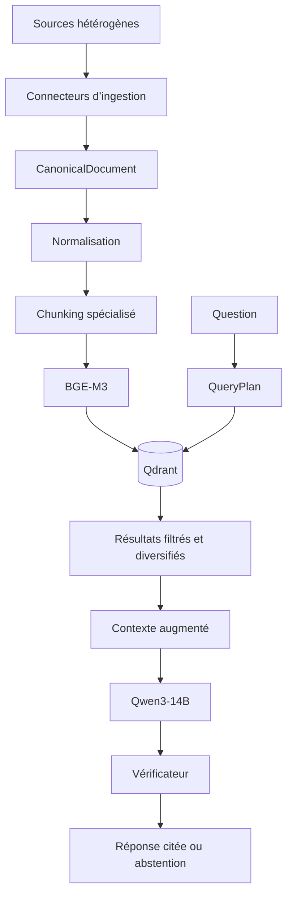

# Architecture technique

## Objectif

Reception Assistant est un système RAG multimodal conçu pour répondre aux questions des équipes de réception à partir de connaissances vérifiées. Il combine documentation logicielle, FAQ, tutoriels vidéo et procédures internes.

L’architecture sépare clairement :

- la préparation des connaissances ;
- la recherche des preuves ;
- la construction du contexte ;
- la génération et la vérification de la réponse.

## Vue d’ensemble

## 1. Couche d’ingestion

Chaque source possède un parseur adapté, mais toutes produisent le même objet `CanonicalDocument`.

| Source | Connecteur | Unité produite |
|---|---|---|
| HTML, Markdown, texte et PDF | `generic_connector/docs.py` | section documentaire cohérente |
| FAQ JSONL ou PDF | `generic_connector/qa.py` | paire question-réponse indivisible |
| Tutoriel vidéo | `generic_connector/videos/` | étape procédurale horodatée |
| Procédure interne YAML | `hotel/knowledge_cards.py` | règle métier avec conditions et escalade |

Le connecteur de logiciel hôtelier implémente `HotelSoftwareKnowledgeSource`. Une nouvelle plateforme peut être ajoutée derrière cette interface sans modifier les couches de normalisation, de recherche ou de génération.

## 2. Schéma canonique

Le schéma central se trouve dans `src/schema/document.py`. Il contient notamment :

- contenu, titre et fil d’Ariane ;
- domaine, sujet et sous-sujet ;
- type, autorité et identifiant de la source ;
- statut, version et méthode de validation ;
- page PDF ou intervalle vidéo ;
- captures associées ;
- identifiant stable et empreinte du contenu.

Cette couche découple les formats d’origine du reste du moteur.

## 3. Normalisation et chunking

`src/normalization/pipeline.py` assure :

- le nettoyage Unicode et typographique ;
- l’application de la taxonomie ;
- la normalisation des chemins ;
- la génération d’identifiants stables ;
- la déduplication par empreinte ;
- la priorité donnée à la source la plus fiable.

`src/chunking/pipeline.py` adapte ensuite le découpage :

- sections et paragraphes pour la documentation ;
- question et réponse conservées ensemble ;
- une action par étape vidéo ;
- une procédure interne complète lorsqu’elle reste de taille raisonnable.

## 4. Embeddings et base vectorielle

`src/retrieval/embeddings.py` utilise BGE-M3 pour produire des vecteurs denses multilingues de 1 024 dimensions. Le titre ou le fil d’Ariane est préfixé au contenu afin d’améliorer le contexte sémantique.

`src/retrieval/vector_store.py` gère Qdrant :

- indexation déterministe ;
- stockage du texte et des métadonnées ;
- filtres de domaine et de statut ;
- fonctionnement local ou distant.

Seuls les documents vérifiés sont utilisés par le moteur final.

## 5. Planification et retrieval

`src/retrieval/query_planner.py` produit un `QueryPlan` déterministe :

- question autonome à partir du contexte conversationnel ;
- expansion d’alias métier ;
- routage vers connaissances logicielles, procédures internes ou les deux ;
- détection des sujets sensibles ;
- filtres adaptés à la demande.

`src/retrieval/retriever.py` applique ensuite :

- recherche dense ;
- seuil de similarité ;
- top K configurable ;
- bonus lexical léger ;
- diversification des sources ;
- équilibrage des domaines pour les questions mixtes.

## 6. Augmentation du contexte

Les passages retenus sont numérotés et accompagnés de leur provenance : titre, domaine, type de source, page, horodatage et capture éventuelle.

Le modèle reçoit uniquement :

- la question ;
- les preuves sélectionnées ;
- les règles de réponse et de citation.

L’augmentation est temporaire : elle ne modifie pas les poids du modèle.

## 7. Génération et contrôle

`src/generation/answer.py` orchestre :

1. une première réponse avec Qwen3-14B ;
2. une seconde passe structurée de vérification ;
3. le contrôle des indices de citations ;
4. des garde-fous déterministes pour les cas sensibles ;
5. l’abstention si les preuves sont absentes ou contradictoires.

Le moteur est compatible avec une exécution locale via Transformers/vLLM et avec des API compatibles OpenAI.

## 8. Interfaces

- `src/cli.py` : indexation, audit, évaluation et questions en ligne de commande ;
- `app/ui.py` : interface Streamlit de référence ;
- `interface_custom/app.py` : interface de démonstration.

Les interfaces dépendent du moteur RAG, mais le moteur ne dépend pas de l’interface.

## 9. Qualité et observabilité

La qualité est couverte par :

- validation Pydantic ;
- rapports d’ingestion et de normalisation ;
- tests unitaires et de non-régression ;
- métriques de retrieval ;
- scénarios de bout en bout ;
- juge indépendant ;
- journalisation des sources et décisions d’abstention.
