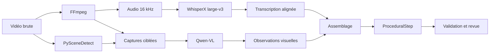

# Pipeline multimodal des tutoriels vidéo

## Pourquoi la transcription seule ne suffit pas

Une vidéo de formation combine trois informations :

- la parole explique l’objectif ;
- l’écran montre le bouton, le champ ou la section ;
- la chronologie relie l’explication à l’action et à son résultat.

Le pipeline transforme donc chaque vidéo en étapes procédurales textuelles, chacune reliée à des preuves visuelles et temporelles.

## Pipeline



## 1. Préparation avec FFmpeg

FFmpeg ne comprend pas le contenu. Il réalise les opérations média déterministes :

- extraction d’une piste audio mono à 16 kHz ;
- capture d’images à des instants précis ;
- vérification des durées et formats.

## 2. Transcription avec WhisperX

WhisperX large-v3 produit :

- le texte prononcé ;
- le début et la fin de chaque segment ;
- un alignement au niveau des mots lorsque disponible.

Des termes métier peuvent être fournis dans le contexte initial afin de limiter les erreurs sur le vocabulaire spécialisé.

## 3. Sélection des images utiles

Toutes les images de la vidéo ne sont pas analysées. Les candidats proviennent de trois signaux :

- fenêtres temporelles autour des phrases d’action ;
- changements visuels détectés par PySceneDetect ;
- captures avant et après une action potentielle.

Les images trop proches sont dédupliquées pour limiter le coût du modèle visuel.

## 4. Analyse visuelle avec Qwen-VL

Le modèle reçoit les captures et un schéma de sortie strict. Il décrit :

- l’écran affiché ;
- l’élément d’interface ciblé ;
- sa position ;
- le type d’action ;
- le résultat visible ;
- son niveau de confiance et ses incertitudes.

Il n’interagit pas avec le logiciel : il analyse uniquement les images fournies.

## 5. Fusion audio-visuelle

Un assembleur combine la phrase transcrite et l’observation visuelle pour produire un `ProceduralStep` :

```json
{
  "instruction": "Ouvrir le dossier et vérifier le statut de la réservation.",
  "action_target": "champ Statut",
  "location": "partie supérieure du dossier",
  "timestamp_start": 134.2,
  "timestamp_end": 138.0,
  "screenshots": ["before.jpg", "target.jpg", "after.jpg"]
}
```

## 6. Validation

La validation combine :

- schémas Pydantic ;
- règles de cohérence temporelle et documentaire ;
- comparaison avec les captures disponibles ;
- échantillonnage humain stratifié par risque et par vidéo ;
- revue individuelle des exceptions.

Sur le corpus de travail, 43 vidéos ont produit 532 étapes candidates. Après contrôle, 527 étapes ont été validées et 5 ont été dépréciées.

## 7. Indexation

Une étape validée devient un document canonique contenant :

- l’instruction autonome ;
- la cible et la position de l’action ;
- le titre de la vidéo ;
- l’intervalle temporel ;
- les chemins des captures ;
- la provenance et le statut de validation.

Le texte est vectorisé avec BGE-M3, tandis que les métadonnées restent disponibles pour les citations et l’affichage dans l’interface.
